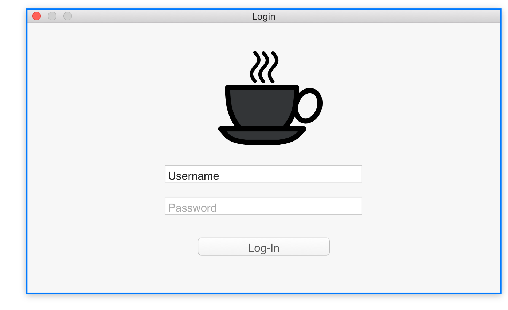

# UI of project

## the login ui

this is the UI where the user insert the credential and after is redirected to
the next page depending on his credential.

## the administrative's pages

#### action page

the first administrative page, it ask to the manager witch action want to do.

#### invectory page

this page allow the administrator to inseert orders for new capsules

