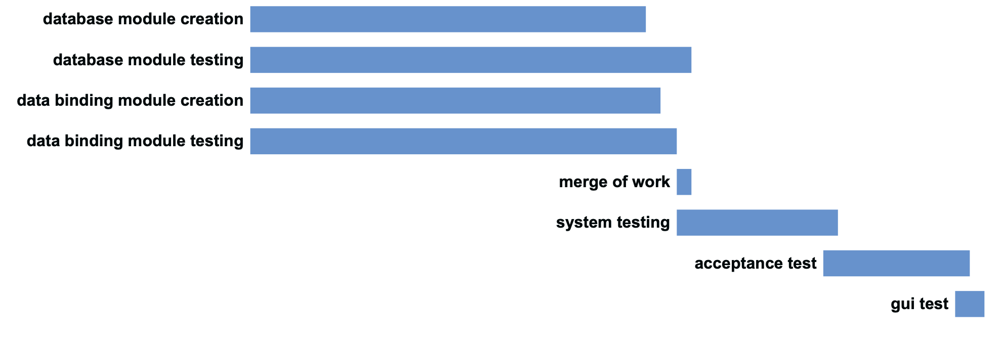

# Project Estimation  template

Authors:
- Elia migliore s267552
- Ndjekoua sandjo jean thibaut s256770
- Roy Paulin Justo Nguetsop Kenfack Djouaka s257855

Date: 02/06/2019

Version: fianl

# Contents

- [[Data from your LaTazza project]

- [Estimate by product decomposition]
- [Estimate by activity decomposition ]


# Data from your LaTazza project

###

|         Total person days worked by your  team, considering period March 5 to April 26 (1 person day == 8 person hours)     |  55 |
| ----------- | ------------------------------- |
|Total Java LoC delivered on April 26 (only code, no Junit code) |1698 |
| Total number of Java classes delivered on April 26 (only code, no Junit code)|10 |
| Productivity P =|1698/63=26.82 |
|Average size of Java class A = | 1698/10=169.8 |

**nb:** we had used an automated command for calculating that lines, it is
replicable and works also in the future, following the code:
```bash
cd src/main && find . -name *.java -exec grep '^.*$' {} \; | wc -l
```

<!--
    to keep only the non blank lines:
    cd src/main && find . -name *.java -exec grep [a-zA-Z0-9{}] {} \; | wc -l
-->

# Estimate by product decomposition

### module database

| database module            | Estimate                        |
| ----------- | ------------------------------- |
| Estimated n classes   |         1                    |
| Estimated LOC per class      |       515                       |
| Estimated effort  (person days)   |    515/26.82=19.2                     |
| Estimated calendar time (calendar weeks) (Assume team of 4 people, 8 hours per day, 5 days per week ) |          121/(3\*8\*5)=1.008         |

### module data binding

|             | Estimate                        |
| ----------- | ------------------------------- |
| Estimated n classes   |              9               |
| Estimated LOC per class        |               258             |
| Estimated effort  (person days) (Here use productivity P)  |     1806/26.82=67.33        |
| Estimated calendar time (calendar weeks) (Assume team of 4 people, 8 hours per day, 5 days per week ) |   103/(3\*8\*5)=0.85 so less than one week                 |


**nb:** we had used 3 as number of team partecipant because we are in 3 because one colleague
has left the team near the beginning of the course.


# Estimate by activity decomposition


### decompositions table

|         Activity name    | Estimated effort    |
| ----------- | ------------------------------- |
| database module creation | 19%=53.77 h  |
| database module testing | 22%=62.26 h |
| data binding module creation | 20%=56.6 h |
| data binding module testing | 21%=59.43 h |
| merge of work | 1%=2.83 h |
| system test | 7%=19.8 h |
| acceptance test | 8%=22.6 h |
| gui test | 2%=5.6 h |

<br>
<br>

## gantt diagram of activity decomposition:

<br>




